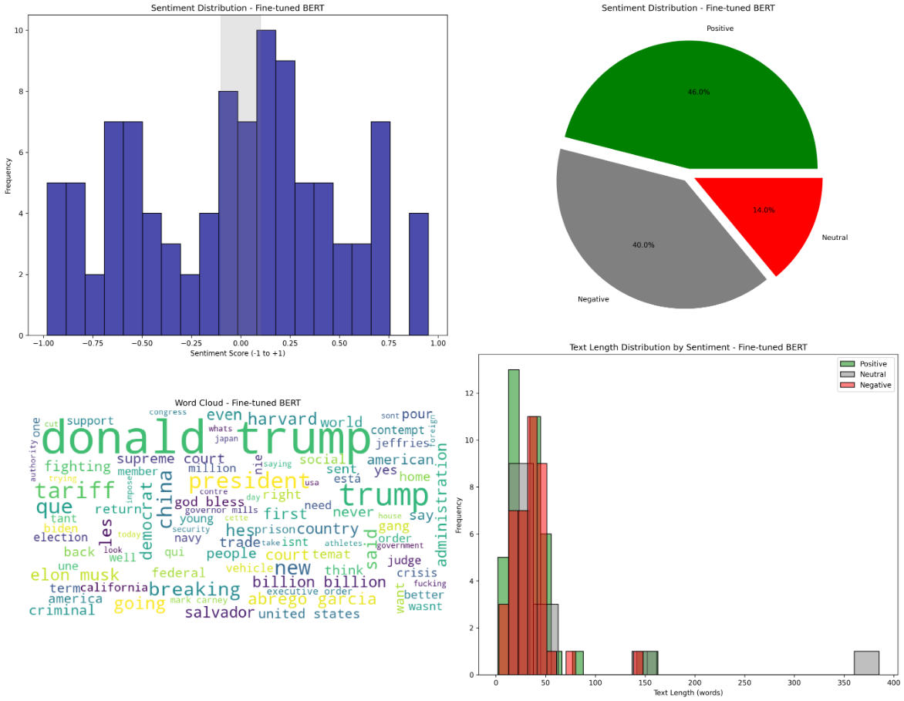
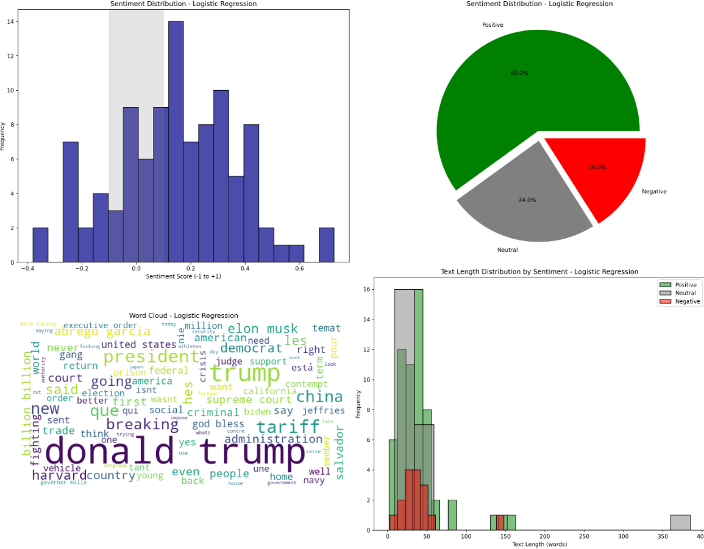
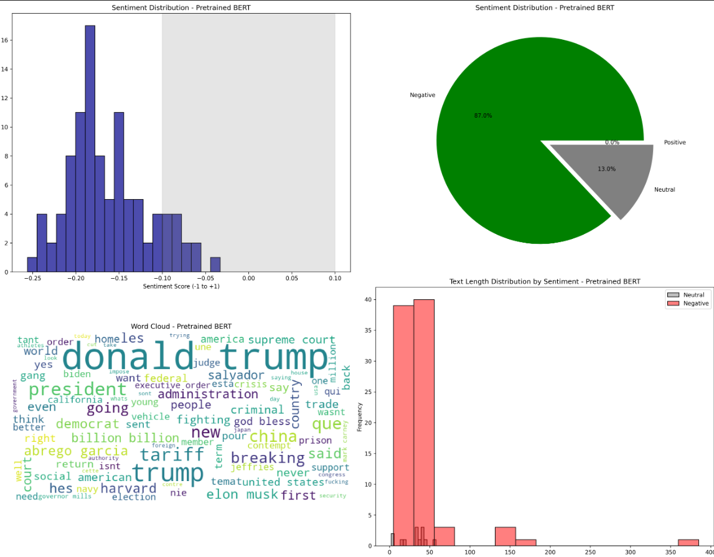
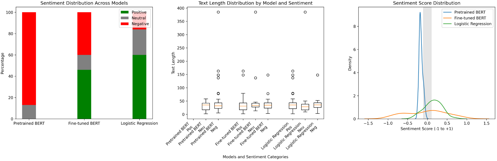
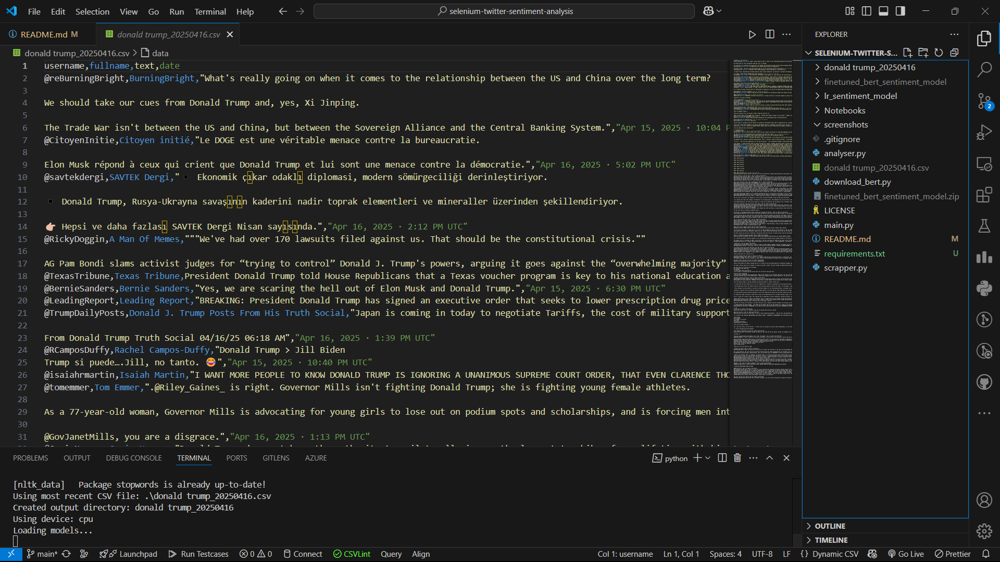

# Twitter Sentiment Analysis Tool

A comprehensive tool for scraping tweets from Nitter.net and analyzing their sentiment using multiple machine learning models.


## Features

- **Tweet Scraping** - Scrape tweets from Nitter.net using Selenium without requiring a Twitter API key
- **Multiple Sentiment Models** - Compare results from three different sentiment analysis approaches:
  - Pre-trained BERT model (state-of-the-art transformer)
  - Fine-tuned BERT model (customized for Twitter sentiment)
  - Logistic Regression model (trained on 1.6M tweets dataset)
- **Comprehensive Visualizations** - Generate detailed visual analytics including sentiment distributions, word clouds, and comparison charts

## Requirements

- Python 3.6+
- Chrome/Chromium browser
- Required Python packages (see `requirements.txt`)

## Installation

1. Clone the repository:
   ```bash
   git clone https://github.com/ShauryaDusht/selenium-twitter-sentiment-analysis.git
   cd selenium-twitter-sentiment-analysis
   ```

2. Install the required dependencies:
   ```bash
   pip install -r requirements.txt
   ```

3. Set up Selenium WebDriver:
   - Download [Chrome WebDriver](https://sites.google.com/chromium.org/driver/) that matches your Chrome browser version
   - Extract the WebDriver executable and add it to your PATH, or place it in your project directory
   - For detailed instructions, see the [Selenium WebDriver installation guide](https://selenium-python.readthedocs.io/installation.html)

## Usage

Run the main script to start the complete pipeline:

```bash
python main.py
```

The script will:
1. Download the BERT model if needed
2. Prompt for a keyword to search
3. Ask for number of tweets to scrape
4. Scrape tweets from Nitter.net
5. Analyze the tweets with all three models
6. Generate visualizations and save results

### Individual Components

You can also run components separately:

**For scraping only:**
```bash
python scrapper.py
```

**For analysis only (after scraping):**
```bash
python analyser.py
```

## Project Structure

- `main.py` - Main script that runs the entire pipeline
- `download_bert.py` - Downloads and extracts the fine-tuned BERT model. Model is saved in Drive.
- `scrapper.py` - Scrapes tweets from Nitter.net using Selenium
- `analyser.py` - Performs sentiment analysis and generates visualizations

## Output

The tool generates a directory named after your search query containing:
- CSV files with sentiment scores for each model
- Visualization images showing sentiment distributions, word clouds, and model comparisons

## Project Structure

```
selenium-twitter-sentiment-analysis/
├── finetuned_bert_sentiment_model/
│   ├── bert_test.py
│   ├── config.json
│   ├── model.safetensors
│   ├── special_tokens_map.json
│   ├── tokenizer_config.json
│   ├── tokenizer.json
│   └── vocab.txt
├── lr_sentiment_model/
│   ├── lr_test.py
│   ├── sentiment_lr_model.pkl
│   └── sentiment_tfidf_vectorizer.pkl
├── Notebooks/
│   └── sentiment_analysis_model.ipynb
├── analyser.py
├── download_bert.py
├── finetuned_bert_sentiment_model.zip
├── LICENSE
├── main.py
├── README.md
├── requirements.txt
└── scrapper.py
```

The repository contains:
- Main Python scripts for scraping and analysis
- Pre-trained model files in their respective directories
- Jupyter notebooks used for model development
- Configuration and documentation files

## Notes

- The first run will download the fine-tuned BERT model (approx. 500MB)
- No Twitter API key is required
- If you prefer using the Twitter API with tweepy instead of web scraping, see [this repository](https://github.com/ShauryaDusht/realtime-twitter-sentiment)

## Model Accuracies

The sentiment analysis is performed using three different models, each with its own performance characteristics:

- **Logistic Regression Model**: 76% accuracy on training dataset
  - Traditional machine learning approach trained on 1.6M tweets
  - Fastest inference time

- **Fine-tuned BERT Model**: 84% accuracy on training dataset
  - Base BERT model fine-tuned specifically for Twitter sentiment
  - Good balance between performance and accuracy

- **Pre-trained BERT Model**: 85% accuracy
  - Hugging Face's implementation of BERT for sequence classification
  - State-of-the-art performance, but slower inference
  
These models provide a comprehensive comparison between traditional machine learning approaches and modern transformer-based methods.


## Screenshots

### Model Visualizations
#### Fine-tuned BERT Model


#### Logistic Regression Model


#### Pre-trained BERT Model


### Model Comparison


### Scraped Tweets CSV File


## License

This project is licensed under the MIT License - see the LICENSE file for details.

## Acknowledgments

- [Nitter](https://nitter.net) for providing a Twitter front-end
- [Hugging Face Transformers](https://huggingface.co/transformers/) for BERT implementations